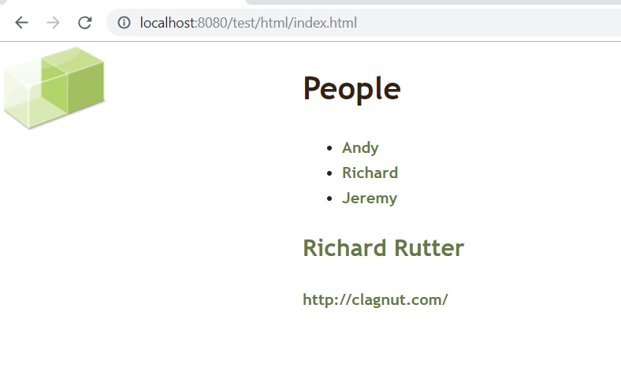

# 数据格式提要

在服务器端 AJAX 是一门与语言无关的技术。在业务逻辑层使用何种服务器端语言都可以。
从服务器端接收数据的时候，那些数据必须以浏览器能够理解的格式来发送。服务器端的编程语言只能以如下 3 种格式返回数据：
- XML
- JSON
- HTML


## 例子

案例原始状态


在body的最后添加

```javascript
<script type="text/javascript">

    window.onload = function () {
        var aNodes = document.getElementsByTagName("a");
        for (var i = 0; aNodes.length > i; i++) {
            aNodes[i].onclick = function () {

                var request = new XMLHttpRequest();
                var method = "GET";
                var url = this.href;

                request.open(method, url);
                request.send(null);

                request.onreadystatechange = function () {
                    if (request.readyState === 4) {
                        if (request.status === 302 || request.status === 200) {
                            document.getElementById("details").innerHTML = request.responseText;
                        }
                    }
                };

                return false;
            };
        }
    }
</script>
```



点击Andy, Richard, 或Jeremy 会切换不同的div内容

## 优缺点

### 优点：

- 从服务器端发送的 HTML 代码在浏览器端不需要用 JavaScript 进行解析。
- HTML 的可读性好。
- HTML 代码块与 innerHTML 属性搭配，效率高。
- 
### 缺点：

- 若需要通过 AJAX 更新一篇文档的多个部分，HTML 不合适

