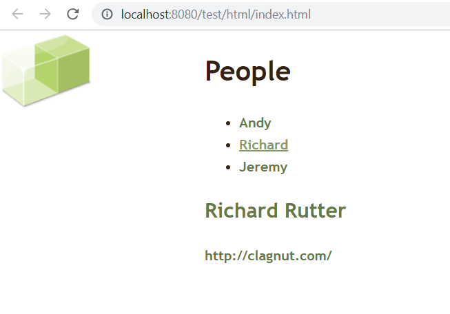
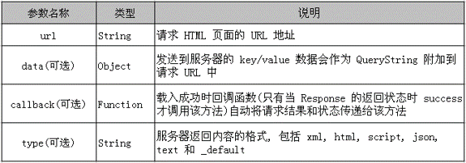

# 用JQuery操作Ajax

## load()方法

- load() 方法是 jQuery 中最为简单和常用的 Ajax 方法, **能载入远程的 HTML 代码并插入到 DOM 中**
- 它的结构是:   load(url[, data][,callback])

将用原生Ajax写的导入html改写

```jsp
<!DOCTYPE html PUBLIC "-//W3C//DTD XHTML 1.0 Strict//EN" "http://www.w3.org/TR/xhtml1/DTD/xhtml1-strict.dtd">
<html xmlns="http://www.w3.org/1999/xhtml" xml:lang="en" lang="en">
<head>
    <meta http-equiv="content-type" content="text/html; charset=utf-8"/>
    <title>People at Clearleft</title>
    <style type="text/css">
        @import url("clearleft.css");
    </style>
    <script type="text/javascript" src="../jsDemo/jquery-3.3.1.js"></script>
    <script type="text/javascript">

        $(function () {
            $("a").click(function () {
                // 使用load方法处理Ajax
                // 这里的url是DOM对象
                var url = this.href;
                var args = {"time":new Date()};

                $("#details").load(url, args);

                return false;
            });
        });

    </script>
</head>
<body>
<h1>People</h1>
<ul>
    <li>
        <a href="files/andy.html">Andy</a>
    </li>
    <li>
        <a href="files/richard.html">Richard</a>
    </li>
    <li>
        <a href="files/jeremy.html">Jeremy</a>
    </li>
</ul>

<div id="details"></div>
</body>
</html>
```



通过JQuery实现了导入html

### load()细节

- 如果只需要加载目标 HTML 页面内的某些元素, 则可以通过 load() 方法的 URL 参数来达到目的. 
- 通过 URL 参数指定选择符, 就可以方便的从加载过来的 HTML 文档中选出所需要的内容. 
- load() 方法的 URL 参数的语法结构为 **“url selector”(注意: url 和 选择器之间有一个空格)**

- 传递方式: **load() 方法的传递参数根据参数 data 来自动自定. 如果没有参数传递, 采用 GET 方式传递, 否则采用 POST 方式。**
- 对于必须在加载完才能继续的操作, load() 方法提供了回调函数, 该函数有三个参数: **代表请求返回内容的 data; 代表请求状态的 textStatus 对象和 XMLHttpRequest 对象**


选择器可以过滤出html文件中哪些内容需要展现

```jsp
url = this.href + " h2 a"
```

这中情况下获取的是全部的html文件，但是只展现了\<h2>\</h2>部分里面的\<a>\</a>。注意空格

## $.get 和 $.post

$.get() 方法使用 GET 方式来进行异步请求. 它的结构是: $.get(url[, data][, callback][, type]);


$.get() 方法的回调函数只有两个参数: data 代表返回的内容, 可以是 XML 文档, JSON 文件, HTML 片段等; textstatus 代表请求状态, 其值可能为: succuss, error, notmodify, timeout 4 种.
$.get()  和 $.post() 方法时 jQuery 中的全局函数, 而 find() 等方法都是对 jQuery 对象进行操作的方法


下面是改写传入xml的脚本

```xml
<?xml version="1.0" encoding="utf-8"?>
<details>
    <name>Andy Budd</name>
    <website>http://andybudd.com/</website>
    <email>andy@clearleft.com</email>
</details>
```

```jsp
	<script type="text/javascript" src="../jsDemo/jquery-3.3.1.js"></script>
        <script type="text/javascript">
            $(function () {
                $("a").click(function () {
                    var url = this.href;
                    var args = {"time":new Date()};

                    $.get(url, args, function (data) {
                        // 获取xml文件中的文本
                        var name = $(data).find("name").text();
                        var email = $(data).find("email").text();
                        var website = $(data).find("website").text();

                        $("#details").empty().append("<h2><a href='" + email + "'>" + name + "</a></h2>")
                            .append("<a href='" + website + "'>" + website + "</a>");
                    });

                    return false;
                });
            })
        </script>
```

- args为JSON格式
- function为回调函数，当相应结束时，回调函数被触发，**返回结果在data中**。


如果导入JSON，和导入xml不同的就是获取name, email, website的方式不一样

```js
{"person": {
  "name":"Andy Budd",
  "website":"http://andybudd.com/",
  "email":"andy@clearleft.com"
  }
}
```

获取方式为

```js
$.get(url, args, function (data) {
                        // 获取xml文件中的文本
                        var name = $(data).find("name").text();
                        var email = $(data).find("email").text();
                        var website = $(data).find("website").text();

                        $("#details").empty().append("<h2><a href='" + email + "'>" + name + "</a></h2>")
                            .append("<a href='" + website + "'>" + website + "</a>");
                    }, JSON);

var name = data.person.name;
var email = data.person.email;
var website = data.person.website;
```

注意要在type属性上指定为JSON，或者把$.get改成$.getJSON。

post也一样


## 案例：