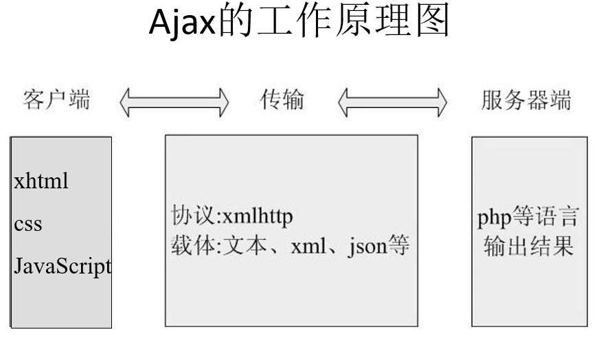

# Ajax

Ajax被认为是(Asynchronous JavaScript and XML的缩写）。现在，允许浏览器与服务器通信而无须刷新当前页面的技术都被叫做Ajax.

## 不用刷新整个页面便可与服务器通讯的办法：

- Flash
- Java applet
- 框架：如果使用一组框架构造了一个网页，可以只更新其中一个框架，而不必惊动整个页面
- 隐藏的iframe
- **XMLHttpRequest**：该对象是对 JavaScript 的一个扩展，可使网页与服务器进行通信。是创建 Ajax 应用的最佳选择。实际上**通常把 Ajax 当成 XMLHttpRequest 对象的代名词**

## Ajax工具包

Ajax并不是一项新技术，它实际上是几种技术，每种技术各尽其职，以一种全新的方式聚合在一起
- 服务器端语言：服务器需要具备向浏览器发送特定信息的能力。Ajax与服务器端语言无关。
- XML (eXtensible Markup Language，可扩展标记语言) 是一种描述数据的格式。Aajx 程序需要某种格式化的格式来在服务器和客户端之间传递信息，XML 是其中的一种选择
- XHTML（eXtended Hypertext Markup Language,使用扩展超媒体标记语言）和 CSS（Cascading Style Sheet,级联样式单）标准化呈现；
- DOM（Document Object Model,文档对象模型）实现动态显示和交互；
使用XMLHTTP组件XMLHttpRequest对象进行异步数据读取
使用JavaScript绑定和处理所有数据

## XMLHttpRequest的概述

### XMLHttpRequest中的方法

|方法|描述|
|---|---|
|abort()|停止当前请求|
|getAllResponseHeaders()|把HTTP请求的所有相应首部作为键值对返回|
|getResponseHeader("header")|返回指定首部的串值|
|**open("method","url")**|建立对服务器的调用，Method参数可以是GET，POST etc. url可以是相对路径或者绝对路径|
|**send(content)**|向服务器发送请求|
|*setRequestHeader("header","value")*|把指定首部设置为所提供的值，在设置任何首部之前必须先调用open()|

### XMLHttpRequest的属性

|属性|描述|
|---|---|
|onreadystatechange|每个状态改变时都会触发这个事件处理器，通常会调用一个javaScript函数|
|readyState|请求的状态，5个可取值：0 未初始化，1 正在加载|
|responseText||
|responseXML||
|status||
|statusText||