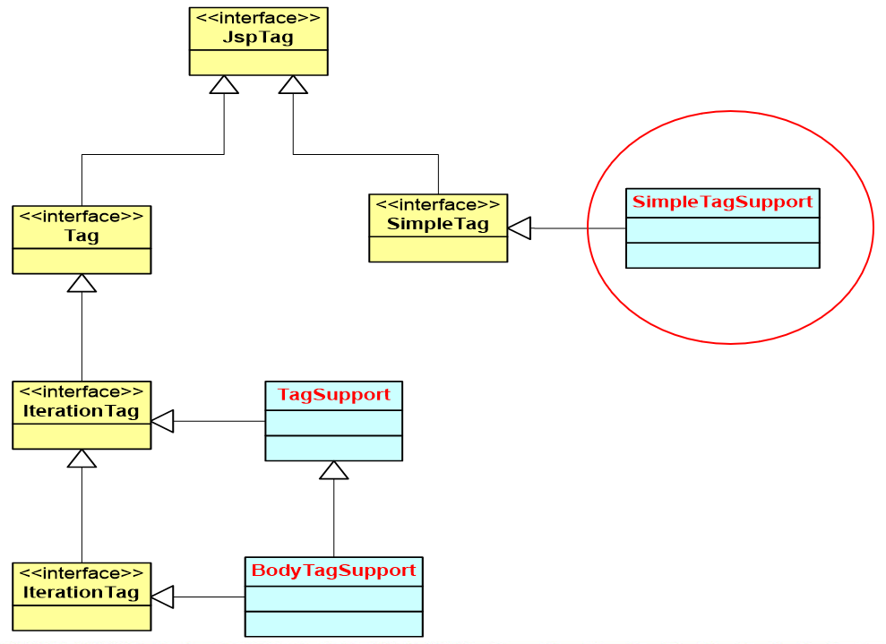

# jstl

## 简单标签

需要将jstl和standard包放到tomcat的lib文件夹下

Servlet中request对象传值

```java
List<Customer> list = new ArrayList<>();
list.add(cus1);
list.add(cus2);

request.setAttribute("list", list);
        request.getRequestDispatcher("tag.jsp").forward(request, response);
```

jsp接收：tag.jsp

```jsp
<%@ taglib prefix="c" uri="http://java.sun.com/jsp/jstl/core" %>

<c:forEach items="${requestScope.list}" var="customer">
    - ${customer.age}, ${customer.name}<br>
</c:forEach>
```

tld文件在做支持

### 自定义标签

用户定义的一种自定义的jsp标记 。当一个含有自定义标签的jsp页面被jsp引擎编译成servlet时，tag标签被转化成了对一个称为 标签处理类 的对象的操作。于是，当jsp页面被jsp引擎转化为servlet后，实际上tag标签被转化为了对tag处理类的操作。 



- 开发自定义标签，其核心就是要编写处理器类，一个标签对应一个标签处理器类，而一个标签库则是很多标签处理器的集合。所有的标签处理器类都要实现 JspTag 接口，该接口中没有定义任何方法，主要作为 Tag 和 SimpleTag 接口的父接口。
- 在 JSP 2.0 以前，所有标签处理器类都必须实现 Tag 接口，这样的标签称为传统标签。
- JSP 2.0 规范又定义了一种新的类型的标签，称为简单标签，其对应的处理器类要实现 SimpleTag 接口

#### 标签的形式
- 空标签：

```html
<hello/>
```

- 带有属性的空标签：

```
   <max num1=“3” num2=“5”/>
```

- 带有内容的标签：

```
  <greeting>
       hello
  </greeting>
```

- 带有内容和属性的标签：

```
 <greeting name=“Tom”>
       hello
  </greeting>
```

#### 自定义标签开发与应用步骤

- 编写完成标签功能的 Java 类(标签处理器)
- 编写标签库描述(tld)文件，在tld文件中对自定义中进行描述
- 在JSP页面中导入和使用自定义标签

先卡一下效果

编写完成标签功能的java类

```java
public class HelloSimpleTag implements SimpleTag {
    @Override
    public void doTag() throws JspException, IOException {
        System.out.println("doTag");
    }

    @Override
    public void setParent(JspTag jspTag) {
        System.out.println("setParent");
    }

    @Override
    public JspTag getParent() {
        System.out.println("getParent");
        return null;
    }

    @Override
    public void setJspContext(JspContext jspContext) {
        System.out.println("setJspContext");
    }

    @Override
    public void setJspBody(JspFragment jspFragment) {
        System.out.println("setJspBody");
    }
}

```


WEBINF下定义tld文件

```tld
<tlib-version>1.0</tlib-version>
<!-- 建议在jsp页面中使用的标签的前缀prefix -->
<short-name>myshortname</short-name>
<!-- 作为tld文件的id，用来为一表示当前的tld文件，多个tld文件的uri不能重复，通过jsp页面的taglib标签的uri属性来引用 -->
<uri>http://mycompany.com</uri>

<tag>
    <!-- 标签的名字 -->
    <name>hello</name>
    <tag-class>tag.HelloSimpleTag</tag-class>
    <!-- 标签体的类型 -->
    <body-content>empty</body-content>
</tag>
```

此时访问一个jsp页面做测试，

```jsp
<%@ taglib prefix="myshortname" uri="http://mycompany.com" %>
<myshortname:hello/>
```

console中会打印：

setJspContext
doTag